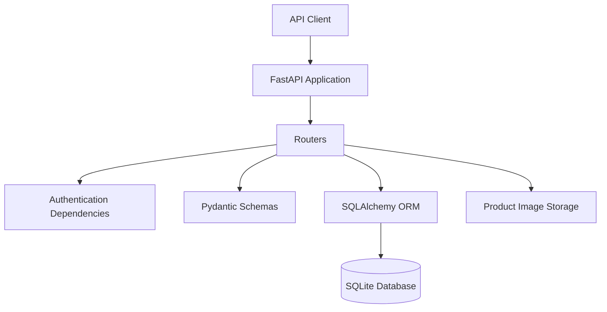
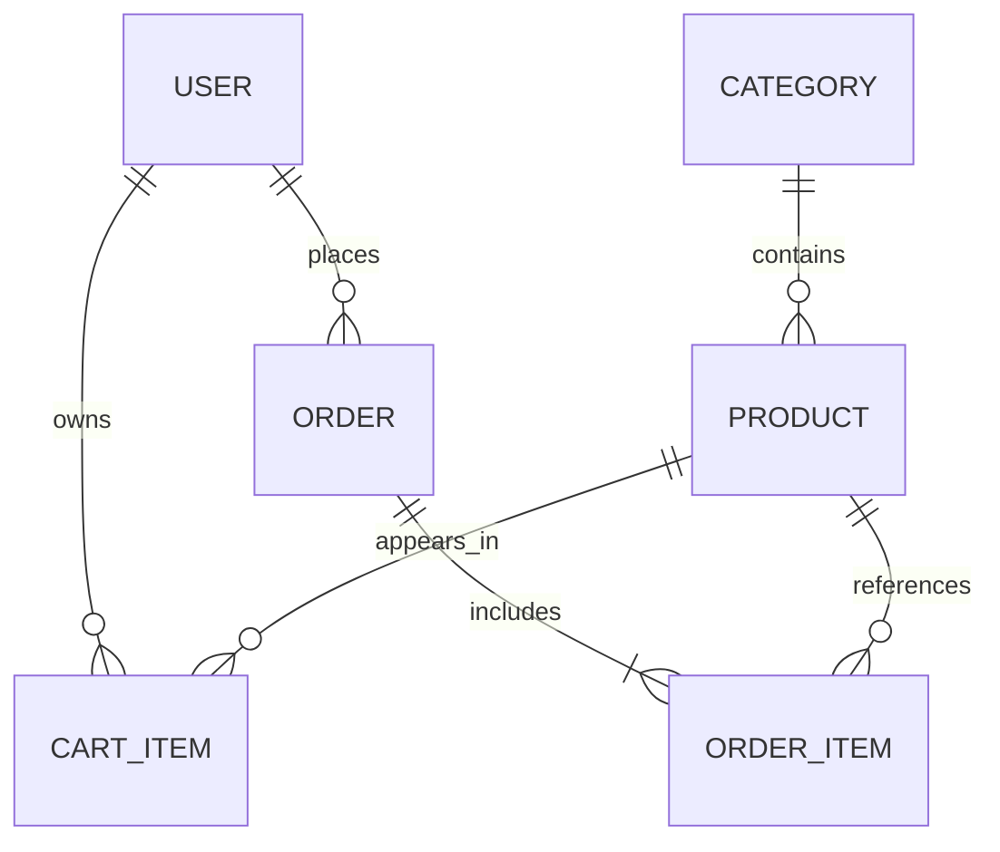

# FastAPI E-Commerce Backend API

<p align="center">
  A modular RESTful backend for an e-commerce platform, built with FastAPI, SQLAlchemy, JWT authentication, and Docker.
</p>

<p align="center">
  
  
  
  
  
  
</p>

## Overview

This project provides the backend services required by a small e-commerce application. It covers the complete flow from user registration and product discovery to cart management and order checkout, while protecting administrative operations with role-based authorization.

The codebase follows a modular structure built around FastAPI routers, Pydantic schemas, SQLAlchemy models, and reusable security dependencies. Interactive API documentation is generated automatically through Swagger UI and ReDoc.

## Key Features

### Authentication and authorization

- User registration with input validation
- OAuth2-compatible login flow
- JWT access tokens with expiration
- Secure password hashing with bcrypt
- Protected user profile endpoint
- Role-based access control for admin operations
- Admin-only user listing

### Product catalog

- Create, read, update, and soft-delete products
- Product search by name
- Minimum and maximum price filtering
- Pagination with item and page counts
- Stock quantity tracking
- Category validation when creating or updating products
- Product image upload with generated unique filenames
- Public delivery of uploaded files through a static route

### Categories

- Create, list, retrieve, update, and delete categories
- Admin-protected write operations
- Optional category descriptions

### Shopping cart

- Add products to an authenticated user's cart
- Merge quantities when the same product is added again
- Update or remove individual cart items
- Clear the entire cart
- Validate product availability and stock before every change
- Isolate cart data by authenticated user

### Orders and checkout

- Convert a user's cart into an order
- Calculate order totals and per-item subtotals
- Save the product price at the time of purchase
- Reduce inventory after checkout
- Clear the cart after a successful order
- Retrieve personal order history and order details
- Allow admins to view all orders
- Restrict order status updates to supported values

### Developer experience

- Automatic Swagger UI and ReDoc documentation
- Health-check endpoint
- Dockerfile and Docker Compose configuration
- Basic API tests with Pytest and FastAPI TestClient
- Clear separation of routers, schemas, models, and utilities

## Tech Stack

| Area | Technology |
| --- | --- |
| API framework | FastAPI |
| ASGI server | Uvicorn |
| ORM | SQLAlchemy 2 |
| Database | SQLite |
| Validation | Pydantic |
| Authentication | OAuth2 password flow and JWT |
| Password security | Passlib and bcrypt |
| File handling | FastAPI `UploadFile` and static files |
| Testing | Pytest and HTTPX/TestClient |
| Containerization | Docker and Docker Compose |

## Architecture



The application uses a layered, feature-oriented structure:

- **Routers** define HTTP endpoints and application workflows.
- **Schemas** validate request data and shape typed responses.
- **Models** map application entities to relational database tables.
- **Dependencies** centralize authentication, authorization, and database sessions.
- **Utilities** handle password hashing and JWT creation.

## Project Structure

```text
.
├── app/
│   ├── models/
│   │   ├── cart_model.py
│   │   ├── category_model.py
│   │   ├── order_model.py
│   │   ├── product_model.py
│   │   └── user_model.py
│   ├── routers/
│   │   ├── auth.py
│   │   ├── cart.py
│   │   ├── category.py
│   │   ├── orders.py
│   │   └── product.py
│   ├── schemas/
│   │   ├── cart_schema.py
│   │   ├── category_schema.py
│   │   ├── order_schema.py
│   │   ├── product_schema.py
│   │   └── user_schema.py
│   ├── utils/
│   │   ├── dependencies.py
│   │   └── security.py
│   ├── database.py
│   └── main.py
├── tests/
│   └── test_basic.py
├── Dockerfile
├── docker-compose.yml
├── requirements.txt
└── README.md
```

## Getting Started

### Prerequisites

Choose either of the following setups:

- Python 3.13 and `pip`
- Docker and Docker Compose

### Local installation

1. Clone the repository:

   ```bash
   git clone https://github.com/AhmadAdas21/MY_fastapi-ecommerce-backend_trial.git
   cd MY_fastapi-ecommerce-backend_trial
   ```

2. Create and activate a virtual environment:

   **Linux, macOS, or WSL**

   ```bash
   python3 -m venv .venv
   source .venv/bin/activate
   ```

   **Windows PowerShell**

   ```powershell
   py -m venv .venv
   .\.venv\Scripts\Activate.ps1
   ```

3. Install the dependencies:

   ```bash
   python -m pip install --upgrade pip
   pip install -r requirements.txt
   ```

4. Start the development server:

   ```bash
   python -m uvicorn app.main:app --reload
   ```

5. Open the API:

   - Base URL: <http://127.0.0.1:8000>
   - Swagger UI: <http://127.0.0.1:8000/docs>
   - ReDoc: <http://127.0.0.1:8000/redoc>
   - Health check: <http://127.0.0.1:8000/health>

The SQLite database and its tables are created automatically when the application starts.

### Run with Docker Compose

```bash
docker compose up --build
```

The API will be available at <http://localhost:8000>. To stop the service, run:

```bash
docker compose down
```

## Authentication Flow

1. Register a user with `POST /auth/register`.
2. Log in with `POST /auth/login` using form data:
   - `username`: the registered email address
   - `password`: the account password
3. Copy the returned `access_token`.
4. Send the token with protected requests:

   ```http
   Authorization: Bearer <access_token>
   ```

In Swagger UI, select **Authorize**, enter the registered email and password, and Swagger will apply the bearer token to protected requests.

New registrations receive the `user` role. Administrative routes require an account whose database role is set to `admin`.

## API Reference

### General

| Method | Endpoint | Access | Description |
| --- | --- | --- | --- |
| `GET` | `/` | Public | Return the API welcome message |
| `GET` | `/health` | Public | Return the service health status |

### Authentication

| Method | Endpoint | Access | Description |
| --- | --- | --- | --- |
| `POST` | `/auth/register` | Public | Register a new user |
| `POST` | `/auth/login` | Public | Authenticate and receive a JWT |
| `GET` | `/auth/me` | User | Return the current user's profile |
| `GET` | `/auth/users` | Admin | List all users |

### Products

| Method | Endpoint | Access | Description |
| --- | --- | --- | --- |
| `GET` | `/products/` | Public | List active products with search, price filters, and pagination |
| `GET` | `/products/{product_id}` | Public | Retrieve one active product |
| `POST` | `/products/` | Admin | Create a product |
| `PUT` | `/products/{product_id}` | Admin | Partially update a product |
| `DELETE` | `/products/{product_id}` | Admin | Soft-delete a product |
| `POST` | `/products/{product_id}/image` | Admin | Upload a product image |

Supported query parameters for `GET /products/`:

| Parameter | Type | Default | Constraint |
| --- | --- | --- | --- |
| `search` | string | `null` | Case-insensitive name search |
| `min_price` | float | `null` | Must be at least `0` |
| `max_price` | float | `null` | Must be at least `0` |
| `page` | integer | `1` | Must be at least `1` |
| `limit` | integer | `10` | Between `1` and `100` |

Example:

```http
GET /products/?search=headphones&min_price=25&max_price=200&page=1&limit=10
```

### Categories

| Method | Endpoint | Access | Description |
| --- | --- | --- | --- |
| `GET` | `/categories/` | Public | List all categories |
| `GET` | `/categories/{category_id}` | Public | Retrieve one category |
| `POST` | `/categories/` | Admin | Create a category |
| `PUT` | `/categories/{category_id}` | Admin | Partially update a category |
| `DELETE` | `/categories/{category_id}` | Admin | Delete a category |

### Cart

| Method | Endpoint | Access | Description |
| --- | --- | --- | --- |
| `GET` | `/cart/` | User | Return the current user's cart |
| `POST` | `/cart/items` | User | Add a product or increase its quantity |
| `PUT` | `/cart/items/{cart_item_id}` | User | Update a cart item quantity |
| `DELETE` | `/cart/items/{cart_item_id}` | User | Remove one cart item |
| `DELETE` | `/cart/clear` | User | Clear the current user's cart |

### Orders

| Method | Endpoint | Access | Description |
| --- | --- | --- | --- |
| `POST` | `/orders/checkout` | User | Create an order from the cart |
| `GET` | `/orders/my-orders` | User | List the current user's orders |
| `GET` | `/orders/{order_id}` | Owner/Admin | Return an order and its items |
| `GET` | `/orders/admin/all` | Admin | List every order |
| `PUT` | `/orders/admin/{order_id}/status` | Admin | Update an order status |

Valid order statuses are `pending`, `paid`, `shipped`, `delivered`, and `cancelled`.

## Data Model



| Entity | Responsibility |
| --- | --- |
| `User` | Identity, credentials, role, and account status |
| `Category` | Product grouping and description |
| `Product` | Catalog data, price, stock, image, and active status |
| `CartItem` | User-specific product selection and quantity |
| `Order` | Customer, total price, and fulfillment status |
| `OrderItem` | Purchased product, quantity, captured unit price, and subtotal |

## Testing

Run the test suite from the project root:

```bash
pytest -q
```

The current smoke tests cover:

- The root endpoint
- The health-check endpoint
- The paginated product response structure

## Security Notes

- Passwords are stored as bcrypt hashes, never as plain text.
- Protected endpoints require a valid, unexpired JWT.
- Admin-only operations are guarded by a reusable authorization dependency.
- Cart and order access is scoped to the authenticated user.
- Uploaded files are checked for an image MIME type and receive unique names.
- Before a production deployment, load the JWT secret from a secure environment variable or secret manager, restrict allowed upload types and sizes, configure CORS deliberately, and use a production database.

## Roadmap

- Move application settings and secrets to environment-based configuration
- Add Alembic database migrations
- Support PostgreSQL for production deployments
- Expand unit and integration test coverage
- Add refresh-token and account-management flows
- Add product sorting and category filtering
- Add payment-provider integration
- Introduce structured logging and centralized error handling
- Add CI/CD checks for linting, tests, and container builds

## Contributing

Contributions, issues, and improvement suggestions are welcome.

1. Fork the repository.
2. Create a feature branch: `git switch -c feature/your-feature`.
3. Commit your changes: `git commit -m "Add your feature"`.
4. Push the branch: `git push origin feature/your-feature`.
5. Open a pull request.

## Author

**Ahmad Adas**

- GitHub: [@AhmadAdas21](https://github.com/AhmadAdas21)

---

If this project helped you or you found it useful, consider giving the repository a star.
